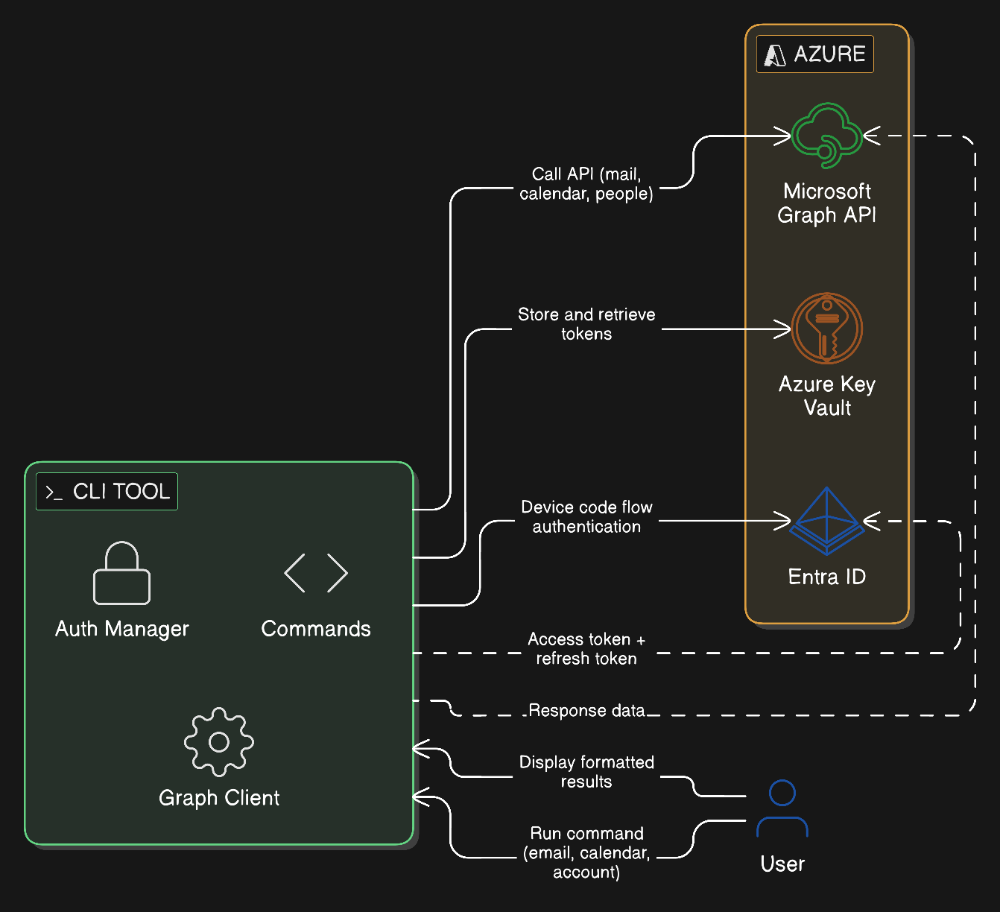
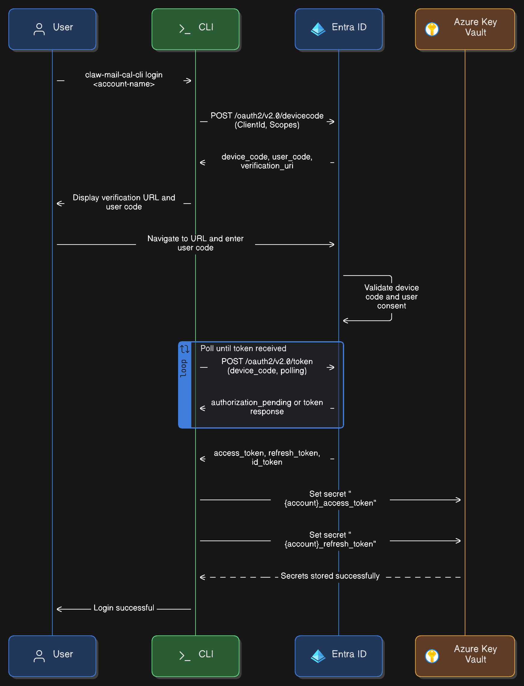
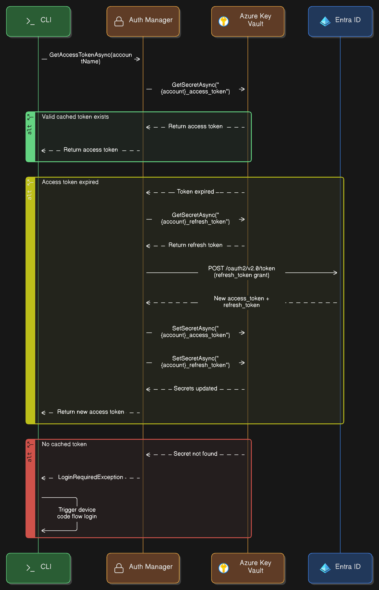
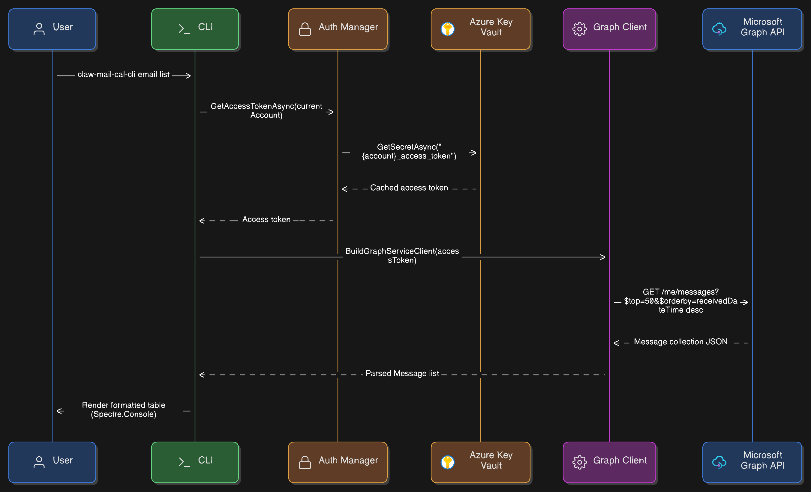
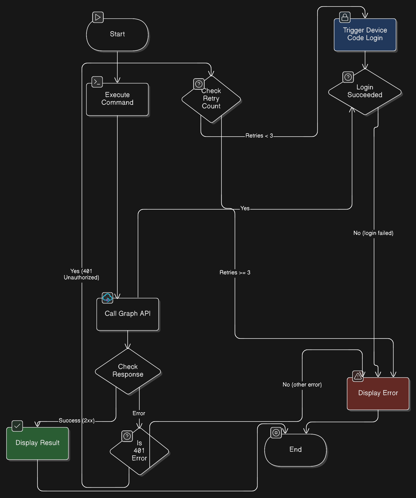

# claw-mail-cal-cli Architecture

## Project Purpose and Goals

`claw-mail-cal-cli` is a command-line interface for accessing email, people, and calendar items via Microsoft Graph. It is designed for use by [OpenClaw](https://github.com/openclaw/openclaw) to provide mail and calendar capabilities without the complexity of MCP server authentication.

The project uses Entra ID's **device code flow** to authenticate users with delegated access to Microsoft Graph, and stores OAuth tokens securely in **Azure Key Vault** for subsequent reuse.

## Technology Stack

| Component | Technology |
|-----------|------------|
| Language | C# / .NET 10 |
| CLI Framework | Spectre.Console.Cli |
| Graph Access | Microsoft Graph SDK (C#) |
| Authentication | Azure Identity (`DeviceCodeCredential`) |
| Token Storage | Azure Key Vault (via Azure CLI Credential) |
| Output Formatting | Spectre.Console |
| Target Platforms | Windows x64, Ubuntu x64 |

## Component Overview

### CLI Tool (`claw-mail-cal-cli`)
The entry point for all user commands. Built with `Spectre.Console.Cli`, it provides a structured command hierarchy:

- **`account`** — Add, list, delete, and set the active account context
- **`login`** — Authenticate an account via Entra device code flow
- **`email`** — List, read, and send emails via Microsoft Graph
- **`calendar`** — List, read, and create calendar events via Microsoft Graph

### Auth Manager
Responsible for retrieving valid access tokens for the current account. It:
1. Checks Azure Key Vault for a cached access token
2. If expired, uses the cached refresh token to obtain a new access token from Entra
3. If no tokens exist, triggers the device code flow login

### Graph Client
Builds a `GraphServiceClient` using the access token provided by the Auth Manager. Delegates all Microsoft Graph API calls (mail, calendar, people).

### Azure Key Vault
Stores OAuth tokens (access token and refresh token) per account. Access to Key Vault uses the **Azure CLI Credential**, which means `az login` must be performed on the machine running the CLI.

### Entra ID
Provides OAuth 2.0 device code flow authentication with delegated permissions for Microsoft Graph (Mail.ReadWrite, Calendars.ReadWrite, People.Read).

## Authentication Flow

1. The user runs a command or explicitly calls `login <account>`.
2. The CLI requests a device code from Entra ID.
3. The user is prompted to visit a verification URL and enter the code.
4. The CLI polls Entra ID until the user completes authentication.
5. Entra ID returns access and refresh tokens.
6. Tokens are stored in Azure Key Vault as secrets named `{account}_access_token` and `{account}_refresh_token`.
7. Subsequent commands retrieve tokens from Key Vault without requiring re-authentication.
8. If a 401 Unauthorized error is received during a Graph API call, the CLI automatically retries the login flow (up to 3 times).

## Diagrams

### System Architecture

High-level view of how the CLI, Entra ID, Microsoft Graph API, and Azure Key Vault fit together.

> Source: [system-architecture.eraserdiagram](../diagrams/system-architecture.eraserdiagram)

---

### Device Code Flow

End-to-end sequence of the login process using Entra ID device code authentication.

> Source: [device-code-flow.eraserdiagram](../diagrams/device-code-flow.eraserdiagram)

---

### Token Caching Flow

How OAuth tokens are stored and retrieved from Azure Key Vault, including the refresh token exchange.

> Source: [token-caching-flow.eraserdiagram](../diagrams/token-caching-flow.eraserdiagram)

---

### Email Command Flow

Step-by-step sequence of how a typical `email list` command resolves the access token and calls Microsoft Graph.

> Source: [email-command-flow.eraserdiagram](../diagrams/email-command-flow.eraserdiagram)

---

### 401 Unauthorized Auto-Login Retry Flow

Flowchart showing how the CLI detects a 401 error from Graph and automatically triggers a re-login.

> Source: [auth-retry-flow.eraserdiagram](../diagrams/auth-retry-flow.eraserdiagram)

---

## References

- [Project Requirements](requirements.md)
- [Example Graph Service Client](example-graph-service-client.md)
- [Microsoft Graph REST API](https://learn.microsoft.com/en-us/graph/api/overview)
- [Azure Identity DeviceCodeCredential](https://learn.microsoft.com/en-us/dotnet/api/azure.identity.devicecodecredential)
- [Azure Key Vault Secrets](https://learn.microsoft.com/en-us/azure/key-vault/secrets/about-secrets)
